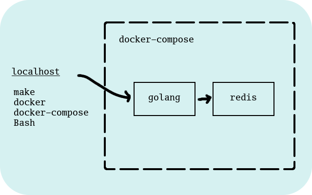

# redis-cache

[](https://travis-ci.org/mramshaw/redis-cache)
[](http://codecov.io/github/mramshaw/redis-cache?branch=master)
[](https://goreportcard.com/report/github.com/mramshaw/redis-cache)
[](https://godoc.org/github.com/mramshaw/redis-cache)
[](https://github.com/mramshaw/redis-cache/releases)

A redis proxy service

## Deployment

The application will be deployed as follows:



## What the code does

The application launches a web server which responds to HTTP requests.

When a request for a specific key is received, the application checks
its cache for the specified key. If found, the value associated with
the key is returned via HTTP. If not found, the request is forwarded
to Redis - if the key is found then the value is stored in the cache
and the value is returned via HTTP. If not found a 404 is returned.

At application startup a daemon process is launched, which runs from
time to time and expires any cache entries older than a configurable
time limit.

The size of the cache may also be specified; only this number of
entries may be stored in the cache, with older entries being evicted
to make space for newer entries.

## How to run

1. Download the repo.

2. Unzip it somewhere.

3. Change directory into the repo:

    $ cd assignment

4. Type the following to run the tests:

    $ make tests

[It may take a few minutes for the docker images to download.]

The results should look as follows (times are GMT):

```
$ make test
docker-compose up -d redis
Creating network "rediscache_redis-caching" with the default driver
Creating rediscache_redis_1 ... 
Creating rediscache_redis_1 ... done
docker-compose up golang
rediscache_redis_1 is up-to-date
Creating rediscache_golang_1 ... 
Creating rediscache_golang_1 ... done
Attaching to rediscache_golang_1
golang_1  | Reformatting source code ...
golang_1  | Vetting source code ...
golang_1  | Testing source code ...
golang_1  | 2018/04/14 20:57:57 Running setUpTestData
golang_1  | === RUN   TestHealthCheck
golang_1  | --- PASS: TestHealthCheck (0.00s)
golang_1  | === RUN   TestCacheHit
golang_1  | --- PASS: TestCacheHit (0.00s)
golang_1  | === RUN   TestCacheMiss
golang_1  | --- PASS: TestCacheMiss (0.00s)
golang_1  | === RUN   TestGetExistingRedisKey
golang_1  | --- PASS: TestGetExistingRedisKey (0.00s)
golang_1  | === RUN   TestGetNonexistentRedisKey
golang_1  | --- PASS: TestGetNonexistentRedisKey (0.00s)
golang_1  | === RUN   TestGetExpiredCacheKey
golang_1  | --- PASS: TestGetExpiredCacheKey (5.40s)
golang_1  | === RUN   TestGetExpiredRedisKey
golang_1  | --- PASS: TestGetExpiredRedisKey (6.00s)
golang_1  | === RUN   TestGetTouchedCacheKey
golang_1  | --- PASS: TestGetTouchedCacheKey (11.41s)
golang_1  | PASS
golang_1  | 2018/04/14 20:58:19 Running tearDownTestData
golang_1  | ok  	redis-cache	22.828s
rediscache_golang_1 exited with code 0
docker-compose down
Stopping rediscache_redis_1 ... done
Removing rediscache_golang_1 ... done
Removing rediscache_redis_1 ... done
Removing network rediscache_redis-caching
$
```

## Dependencies

The various libraries are bundled in a __vendor__ directory.

This is perhaps not ideal but they would need to be downloaded
in any case, and it is always nice to have all dependencies
bundled with source code.

The dependencies are sourced as follows:

``` Bash
$ GOPATH=`pwd`/vendor/ go get -d -v .
```

## To Do

- [ ] Refactor to avoid duplicate mutexes
- [x] Refactor to include 12-Factor initialization in code coverage
- [ ] Add goroutines for multiple clients ([pool](https://godoc.org/github.com/mediocregopher/radix.v2/pool) looks useful)
- [ ] Add RESP ([respgo](https://github.com/teambition/respgo) looks useful
- [ ] Add pipelining
